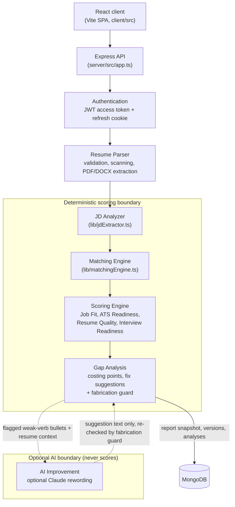

# System Architecture

This document describes how ResumeFit AI is built: the layers, the modules that implement them, how a request moves through the server, where data is stored, and how the system is observed in operation. Everything described here is implemented in the repository; file paths are relative to the repository root.

Related documents: [database.md](database.md) (collections and indexes), [api.md](api.md) (endpoint reference), [ai-pipeline.md](ai-pipeline.md) (NLP and AI pipeline), [scoring.md](scoring.md) (score formulas and weights), [security.md](security.md), [deployment.md](deployment.md), [testing.md](testing.md), [research.md](research.md).

---

## 1. Design principle: AI ≠ final scoring authority

All four scores (Job Fit, ATS Readiness, Resume Quality, Interview Readiness) are produced by one deterministic function, `runAnalysis()` in `server/src/lib/scoringEngine.ts`. For the same resume text, job description, extraction metadata and practised-question list it always returns the same report. It uses no randomness, makes no network calls and calls no language model.

The large language model (Anthropic Claude, through `server/src/services/aiRewriter.ts`) is optional and limited:

- It is disabled unless `ANTHROPIC_API_KEY` is set on the server.
- It can only propose alternative wording for bullet points that the deterministic engine has already flagged (`weak-verb` fixes).
- Every proposal goes through the deterministic fabrication guard (`server/src/lib/fabricationGuard.ts`). Proposals that add skills, numbers or named entities are marked as not accepted.
- Its output never reaches the scoring engine directly. If a user applies reworded text, the text becomes a new immutable resume version, and that version is scored by the same deterministic engine as every other version.

**AI ≠ final scoring authority.** The AI never computes, adjusts or overrides a score.

---

## 2. Layered system view



Reading the diagram:

- The solid path is the request path for an analysis. Each box corresponds to a module listed in Section 4.
- The **Deterministic scoring boundary** contains every component that can affect a score. In code, everything inside it is called from `runAnalysis()`.
- The **Optional AI boundary (never scores)** contains only the Claude rewording call. It has one input (bullets that the engine flagged) and one output (candidate text), and the output goes back only to the fabrication guard in Gap Analysis. There is **no edge from the AI box to the Scoring Engine**. A rewording affects a score only if the user applies it, which creates a new version that is then re-scored by the same deterministic engine.
- Structuring the resume text (section detection, entry splitting, skill evidence) is the first step inside `runAnalysis()`. It is described in [ai-pipeline.md](ai-pipeline.md).

---

## 3. Analysis lifecycle (sequence)

The diagram below covers the main workflow: upload, parse, analyse, persist, apply fixes, create a new version, re-score and compare.

```mermaid
sequenceDiagram
    autonumber
    actor U as User (browser)
    participant C as React client
    participant A as Express API
    participant P as resumeParser.ts
    participant E as runAnalysis() (deterministic)
    participant G as fabricationGuard.ts
    participant M as MongoDB

    U->>C: Choose PDF/DOCX + paste JD
    C->>A: POST /api/analysis (multipart: resume, jobDescription)<br/>Authorization: Bearer access token
    A->>A: authMiddleware, requireDatabase, analysis limiter, multer (5 MB), Zod
    A->>P: parseResumeFile(buffer, name, mime)
    P->>P: validate extension, size, MIME, magic bytes
    P->>P: optional ClamAV scan
    P->>P: extract text (pdf-parse / mammoth HTML) + layout signals, normalise
    P-->>A: { text, extraction meta }
    A->>M: Resume.create; $inc latestVersionNumber; ResumeVersion.create (v1, source "upload")
    A->>E: runAnalysis(JD, text, extraction)
    E-->>A: AnalysisReport (scores, matches, costing points, fixes, interview)
    A->>M: Analysis.create (full report embedded)
    A->>M: ResumeVersion.updateOne score snapshot (only if not yet set)
    A-->>C: 201 analysis

    U->>C: Select fixes (edit text, confirm new claims)
    C->>A: POST /api/analysis/:id/fixes { fixes: [{id, finalText?, confirmed?}] }
    A->>M: load Analysis + its ResumeVersion
    A->>G: placeholders? requiresConfirmation? checkFabrication(source, finalText)
    G-->>A: ok / violations (rejected with 422 unless confirmed)
    A->>A: applyFixes(text, accepted) -> new text + change log
    A->>M: ResumeVersion.create (v2, source "fix", parentVersionId = v1, changes)
    A->>E: runAnalysis(same JD, v2 text, inherited extraction)
    E-->>A: new AnalysisReport
    A->>M: Analysis.create (previousAnalysisId = first analysis); snapshot onto v2
    A->>A: compareReports(before, after, changes)
    A-->>C: 201 { analysis, comparison, changes }

    opt Determinism check
        C->>A: POST /api/analysis/:id/rescore
        A->>E: runAnalysis on stored version + JD
        A-->>C: { scores, identical, comparison }
    end

    C->>A: GET /api/analysis/:newId/compare/:oldId or GET /api/resumes/compare/:a/:b
    A->>M: load both analyses / versions
    A-->>C: score deltas, category deltas, requirement changes, attribution, line diff
```

Manual edits (`POST /api/resumes/:resumeId/versions`) and restores (`POST /api/resumes/versions/:versionId/restore`) follow the same pattern: create a new version, call `analyzeVersion()`, then return a comparison. History is never rewritten. A restore creates a new version whose content is copied from an older one.

---

## 4. Major modules

### 4.1 Server (`server/src`)

| File | Responsibility |
|---|---|
| `server.ts` | Process entry point. Runs `validateEnv()` and exits if configuration is invalid, connects to the database, starts listening, and handles graceful shutdown on SIGTERM/SIGINT. |
| `app.ts` | Builds the Express application: global middleware chain, `/api/health`, router mounting, `/api/analytics`, optional static client serving, 404 and error handlers. |
| `config/env.ts` | Reads and types every environment variable (port, JWT, Mongo URI, demo mode, CORS origins, `SERVE_CLIENT`, `TRUST_PROXY`, token TTLs, cookie flags, ClamAV, Anthropic key). `validateEnv()` enforces the production rules. |
| `config/database.ts` | Mongoose connection. Selects one of three modes: real MongoDB, opt-in in-memory demo (`mongodb-memory-server`), or `unavailable`; `test` is used under Vitest. Redacts credentials from connection errors. |
| `middleware/requestContext.ts` | Assigns or propagates `X-Request-Id`, stores it in `AsyncLocalStorage`, and logs `request.completed` with duration. |
| `middleware/sanitize.ts` | Deletes object keys that start with `$` or contain `.` from body and query (protection against MongoDB operator injection). |
| `middleware/rateLimit.ts` | `express-rate-limit` factory and the named limiters (`api`, `auth`, `refresh`, `analysis`, `mutation`, `export`, `ai`, `research`). All return a JSON 429 `RATE_LIMITED`. |
| `middleware/auth.ts` | Verifies the HS256 access token (issuer and audience checked, `typ: "access"`); maps errors to `TOKEN_EXPIRED` / `TOKEN_INVALID`. |
| `middleware/requireDatabase.ts` | Returns 503 `DATABASE_UNAVAILABLE` when Mongoose is not connected. |
| `middleware/errorHandler.ts` | `HttpError`, `asyncHandler`, the 404 handler and the central error handler. Maps parse, Multer, cast, JSON and size errors to safe JSON responses. |
| `routes/authRoutes.ts` | Register, login, refresh (rotation), logout, logout-all, me, profile. |
| `routes/analysisRoutes.ts` | Create/list/get/delete analyses, report export, fixes, rescore, AI rewrite, practice tracking, analysis comparison, legacy `/score` and `/upload`. |
| `routes/resumeRoutes.ts` | Resume families, version detail, export (DOCX/PDF), manual-edit versions, restore, version comparison, analyses per version. |
| `routes/applicationRoutes.ts` | Job-application tracker CRUD with status timeline. |
| `routes/researchRoutes.ts` | Evaluation dataset and the experiment runner. |
| `services/analysisService.ts` | Orchestration: `createAnalysis`, `createVersion`, `analyzeVersion`, `applyFixesAndRescore`, `createEditedVersion`, `restoreVersion`, `rescoreAnalysis`, `setQuestionPracticed`, legacy `analyzeResume`. |
| `services/resumeParser.ts` | Upload validation (extension, size, MIME, magic bytes), scan hook, PDF extraction (`pdf-parse`, including table and image detection), DOCX extraction (`mammoth` HTML to text), `NO_TEXT` detection. |
| `services/fileScanner.ts` | `NoopScanner` (default) and `ClamdScanner` (clamd INSTREAM over TCP). |
| `services/tokenService.ts` | Access token issuance and verification; opaque refresh tokens (SHA-256 hashed), rotation, reuse detection, family and all-session revocation. |
| `services/aiRewriter.ts` | Optional Claude rewording with structured output; every result is passed through `checkFabrication`. |
| `services/exportService.ts` | Resume export to DOCX (`docx`) and PDF (`pdfkit`); analysis report PDF. |
| `services/analyticsService.ts` | Dashboard metrics computed from stored applications, analyses and versions. |
| `services/auditService.ts` | Fire-and-forget audit records in `auditlogs`, also written to the log. |
| `lib/scoringEngine.ts` | `runAnalysis()`, the single deterministic entry point; `SCORING_VERSION` and changelog; v1 compatibility wrapper. |
| `lib/resumeStructurer.ts` | Text normalisation, section detection, entry splitting, education parsing, skill evidence collection and grading. |
| `lib/skillOntology.ts` | Static skill ontology (141 skills): aliases, case-sensitive tokens, collision guards, implications, related-skill groups. |
| `lib/jdExtractor.ts` | Job description structuring: role, company, seniority, experience, education, mandatory/preferred skills, responsibilities, domain keywords. |
| `lib/matchingEngine.ts` | Requirement matching (five match states), responsibility matching, Job Fit components, point-loss attribution. |
| `lib/atsReadiness.ts`, `lib/resumeQuality.ts`, `lib/projectAnalysis.ts`, `lib/interviewPrep.ts` | ATS Readiness, Resume Quality, project/internship analysis, interview questions and Interview Readiness. See [scoring.md](scoring.md). |
| `lib/fixSuggestions.ts` | Fix generation (nine types) and `applyFixes()` text patching with a change log. |
| `lib/fabricationGuard.ts` | Detection of new skills, numbers and entities; placeholder detection. |
| `lib/compare.ts` | Report comparison, change attribution, line diff. |
| `observability/logger.ts` | JSON-lines logger with request context, secret scrubbing and the `timed()` helper. |
| `models/*.ts` | Mongoose schemas (see [database.md](database.md)). |
| `research/*.ts` | Offline evaluation: TF-IDF, MiniLM embeddings, metrics, experiment runner, labelled dataset (see [research.md](research.md)). |

### 4.2 Client (`client/src`)

| File | Responsibility |
|---|---|
| `App.tsx` | Route table. Public: `/`, `/login`, `/register`. Protected (lazy-loaded): `/dashboard`, `/analyze`, `/results/:id`, `/results/:id/interview`, `/resumes`, `/resumes/:resumeId/edit`, `/resumes/compare/:a/:b`, `/applications`, `/research`, `/profile`. |
| `api/client.ts` | Typed wrapper around `fetch` for every API call. Keeps the access token in memory only, refreshes once on 401 and retries, de-duplicates concurrent refreshes, and sends `X-Requested-With: resumefit` on refresh and logout. |
| `context/AuthContext.tsx` | Restores the session on load via `POST /api/auth/refresh`. Caches only non-secret profile data in `localStorage` and handles session expiry. |
| `pages/*.tsx` | `AnalysisPage` (upload/paste + JD), `ResultsPage` (scores, requirements, costing points, fixes, AI rewording), `InterviewPage`, `ResumesPage`, `EditVersionPage`, `CompareVersionsPage`, `ApplicationsPage`, `DashboardPage` (analytics), `ResearchPage`, `ProfilePage`, `HomePage`, `LoginPage`, `RegisterPage`. |

In development the Vite dev server (port 5173) proxies `/api` to the API on port 5000, so the browser sees a single origin.

---

## 5. Data flow

1. **Input.** The client sends the job description plus either a file (`resume` multipart field), pasted text (`resumeText`), or the id of an existing version (`resumeVersionId`).
2. **Parsing.** Files are validated and, if ClamAV is configured, scanned. Text is then extracted and normalised. Extraction metadata (page count, characters per page, tables, images, multi-column signal, unusual-character ratio, warnings) is kept because ATS Readiness uses it.
3. **Versioning.** A `Resume` family and version 1 are created. Version content is immutable.
4. **Analysis.** `runAnalysis()` structures the JD and the resume, matches requirements, computes the four scores, attributes every lost point, and generates fix suggestions and interview preparation.
5. **Persistence.** The whole report is embedded in an `Analysis` document. A compact score snapshot (scores, per-component breakdown, job, scoring version) is written once onto the version.
6. **Improvement.** Accepted fixes, manual edits or restores produce a new version, which is analysed with the same engine and compared with its predecessor.
7. **Tracking.** Applications can link to an analysis. The server copies the job-fit score and version number from the linked analysis and never takes them from client input. Analytics are computed on request from stored records.

---

## 6. Storage

| Store | Contents |
|---|---|
| MongoDB (Mongoose 8) | `users`, `resumes`, `resumeversions`, `analyses`, `applications`, `experiments`, `refreshtokens`, `auditlogs`. See [database.md](database.md). |
| Process memory | Access tokens are stateless JWTs, so the server keeps no session table. Rate-limit counters use the `express-rate-limit` in-memory store, so they are per process. The MiniLM embedding cache and the "experiment running" flag are also per process. |
| Local disk | Only the transformers.js model cache, used by the research module when embeddings are first requested. Uploaded files are held in memory (`multer.memoryStorage()`) and never written to disk; only the extracted text is persisted. |
| Code | The skill ontology, JD heading patterns, interview question banks and the research dataset are static data inside the codebase, not database collections. |

---

## 7. Request lifecycle

The global middleware runs in exactly this order, as registered in `server/src/app.ts`:

| # | Middleware | Effect |
|---|---|---|
| 0 | `app.disable('x-powered-by')`; `trust proxy` if `TRUST_PROXY` > 0 | Hides the framework header; makes `req.ip` correct behind N proxies so IP-based rate limiting works. |
| 1 | `requestContextMiddleware` | Accepts an incoming `X-Request-Id` if it matches `^[A-Za-z0-9._-]{8,64}$`, otherwise generates a UUID. Echoes it in the response header, runs the rest of the request inside `AsyncLocalStorage`, and logs `request.completed` on finish. |
| 2 | `helmet` | Security headers, including a strict Content-Security-Policy (`default-src 'self'`, `frame-ancestors 'none'`, `object-src 'none'`; Google Fonts allowed for styles and fonts). |
| 3 | `cors` | `origin` = the `CLIENT_URL` list, or `false` (same-origin only) if unset; `credentials: true` for the refresh cookie. |
| 4 | `cookieParser` | Parses the `rf_refresh` cookie. |
| 5 | `express.json({ limit: '2mb' })`, `express.urlencoded({ limit: '2mb' })` | JSON and form body parsing. |
| 6 | `sanitizeInput` | Strips `$`-prefixed and dotted keys from `req.body` and `req.query`. |
| 7 | `limiters.api` on `/api` | 1000 requests per 15 minutes per IP. |
| 8 | Routes | `GET /api/health`; `/api/auth`, `/api/analysis`, `/api/resumes`, `/api/applications`, `/api/research`; `GET /api/analytics`. |
| 9 | `notFoundHandler` on `/api` | Unknown API paths return 404 `NOT_FOUND` as JSON and never fall through to the SPA. |
| 10 | Static client (only if `SERVE_CLIENT=true` and `client/dist/index.html` exists) | Serves `client/dist`, with `index.html` as the fallback for client routes. |
| 11 | `notFoundHandler`, `errorHandler` | Final 404, then conversion of every thrown error to safe JSON. Stack traces are logged and never sent to the client. |

Each router then applies its own chain. Typically: `authMiddleware` → `requireDatabase` → route-specific limiter → `multer` (upload routes only) → Zod validation → handler wrapped in `asyncHandler`. Because the per-route limiter runs after `authMiddleware`, the `analysis`, `mutation`, `export`, `ai` and `research` limiters are keyed by user id rather than IP. The exact chain for each endpoint is listed in [api.md](api.md).

---

## 8. Observability

**Structured logs.** `observability/logger.ts` writes one JSON object per line: `info`/`debug` to stdout, `warn`/`error` to stderr. Every line includes `time`, `level` and `event`. Lines written during a request also include `requestId`, and `userId` once authentication has run. Keys that look like secrets (password, token, secret, authorization, cookie, api key, mongo uri) are replaced with `[redacted]` at any nesting depth. The level is set by `LOG_LEVEL` (default `info`; logs are silenced under `NODE_ENV=test`).

Main events:

| Event | Fields |
|---|---|
| `request.completed` | `method`, `path` (without query string), `status`, `durationMs`, `ip` |
| `resume.parsed` | `fileType`, `bytes`, `durationMs`, `ok` (parser duration, via `timed()`) |
| `upload.scanned` / `upload.infected` / `upload.scan_skipped` | scanner engine, duration, signature |
| `ai.rewrite` | `bullets`, `model`, `durationMs`, `ok` (AI call duration, via `timed()`); `ai.rewrite_unusable` on refusal or malformed output |
| `database.connected` | `durationMs` (connection time); `database.unavailable` with a redacted error; `database.demo_mode` |
| `rate_limit.exceeded` | `limiter`, `path` |
| `audit` | `action` plus non-sensitive metadata (also persisted to `auditlogs`) |
| `request.failed` | error message and stack for unexpected 500s |
| `config.invalid`, `server.started`, `server.stopping` | process lifecycle |

Database timing is recorded as the connection duration at startup and as a live `ping` round-trip in the health endpoint. Individual queries are not timed.

**Health endpoint.** `GET /api/health` (no authentication) returns:

```json
{
  "status": "ok | degraded",
  "service": "RESUMEFIT AI API",
  "database": { "connected": true, "mode": "mongodb | demo-in-memory | unavailable | test", "pingMs": 2 },
  "scoringVersion": "2.1.0",
  "aiRewrite": false,
  "uploadScanning": "none | clamav",
  "uptimeSeconds": 1234
}
```

It responds 200 when the database is connected (or in test mode) and 503 otherwise, so it can be used directly as a load-balancer or container health check.

---

## 9. Deployment topology options

**Two origins (default).** The client is built and hosted separately. `CLIENT_URL` lists its origin(s) for CORS, and the refresh cookie needs suitable `COOKIE_SAMESITE`/`COOKIE_SECURE` values.

**Single origin (`SERVE_CLIENT=true`).** The API also serves `client/dist` with a one-hour static cache and an `index.html` fallback for client-side routes. `/api/*` 404s are still JSON because the API 404 handler is registered before the static handler. CORS is then unnecessary and the refresh cookie can stay `SameSite=Strict`. See [deployment.md](deployment.md).

---

## 10. Database modes: demo vs production

| Situation | Behaviour |
|---|---|
| `NODE_ENV=production` and `JWT_SECRET` missing or shorter than 32 characters, `MONGO_URI` missing, `DEMO_MODE` enabled, `COOKIE_SAMESITE=none` without `COOKIE_SECURE=true`, or `CLAMAV_REQUIRED=true` without `CLAMAV_HOST` | `validateEnv()` reports each problem as `config.invalid` and the process exits with code 1. **The server refuses to start.** No development defaults are used in production (`jwtSecret` and `mongoUri` default to empty strings there). |
| `DEMO_MODE=true` or `--demo` (`npm run dev:demo`), non-production only | Starts an in-memory MongoDB (`mongodb-memory-server`, database `resumefit-demo`) and logs a warning. All data is lost on restart. `/api/health` reports `mode: "demo-in-memory"`. |
| Normal start and MongoDB reachable | `mode: "mongodb"`; the connection time is logged. |
| Normal start and MongoDB unreachable (5 s server-selection timeout) | The server still starts and logs `database.unavailable`. It does **not** silently fall back to demo data. Every route behind `requireDatabase` returns `503 DATABASE_UNAVAILABLE`; outside production the response also carries the redacted connection error as `detail`. `/api/health` returns 503 `degraded`. The legacy stateless `/api/analysis/score` and `/api/analysis/upload` still work, because they need authentication but no database. |

---

## 11. Versioning of the engine

`SCORING_VERSION` (currently `2.1.0`, equal to `MATCHING_VERSION`) is stored on every analysis and on every version snapshot, and is reported by `/api/health`. `SCORING_CHANGELOG` in `scoringEngine.ts` records every change that can move a score. Because each analysis keeps its full report, historical results stay readable and comparable after the engine is upgraded. `POST /api/analysis/:id/rescore` re-runs the current engine on stored inputs and reports whether the scores are `identical`.
