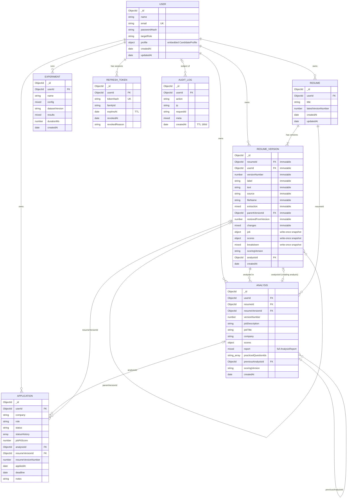

# Database Design

ResumeFit AI stores its data in MongoDB through Mongoose 8. This document lists the collections that exist in the code (`server/src/models/*.ts`) with their fields, relationships and indexes. It then maps the conceptual entities usually expected in a design of this kind to where each one is actually stored.

Related documents: [architecture.md](architecture.md), [api.md](api.md), [ai-pipeline.md](ai-pipeline.md), [scoring.md](scoring.md), [security.md](security.md).

---

## 1. Collections at a glance

| Collection | Model file | Purpose | Retention |
|---|---|---|---|
| `users` | `models/User.ts` | Account, credentials hash, embedded candidate profile | Permanent |
| `resumes` | `models/Resume.ts` (`ResumeModel`) | A resume "family" that groups versions | Permanent |
| `resumeversions` | `models/Resume.ts` (`ResumeVersionModel`) | Immutable snapshot of resume text plus change log and score snapshot | Permanent |
| `analyses` | `models/Analysis.ts` | One engine run of (resume version × job description), with the full report embedded | Until the user deletes it |
| `applications` | `models/Application.ts` | Job-application tracker with a status timeline | Until the user deletes it |
| `experiments` | `models/Experiment.ts` | Research experiment configurations and results | Permanent |
| `refreshtokens` | `models/RefreshToken.ts` | Hashed refresh tokens grouped into rotation families | TTL: removed at `expiresAt` |
| `auditlogs` | `models/AuditLog.ts` | Security-relevant events | TTL: 180 days |

Collection names are the Mongoose defaults: the model name, lower-cased and pluralised.

---

## 2. Entity-relationship diagram

All references are Mongoose `ObjectId` refs. MongoDB does not enforce foreign keys, so ownership and existence are checked in the service and route code. Every read and write filters by the authenticated `userId`.

---

## 3. Collection reference

### 3.1 `users`

| Field | Type | Constraints |
|---|---|---|
| `name` | String | required, trimmed |
| `email` | String | required, **unique**, lower-cased, trimmed |
| `passwordHash` | String | required; bcrypt, cost 12 |
| `targetRole` | String | default `"Software Engineer"` |
| `profile` | `CandidateProfile` subdocument (`_id: false`) | default `{}` |
| `createdAt`, `updatedAt` | Date | Mongoose timestamps |

`CandidateProfile` (embedded): `phone`, `location`, `college`, `degree`, `branch`, `graduationYear` (Number), `cgpa` (String), `linkedin`, `github`, `portfolio`, `bio` (max 600), `preferredLocations` (String[]).

Indexes: `_id`; unique `email`.

`toPublicUser()` defines the only shape sent to clients: `id`, `name`, `email`, `targetRole`, `profile`, `createdAt`. The password hash never leaves the server.

### 3.2 `resumes`

| Field | Type | Constraints |
|---|---|---|
| `userId` | ObjectId → User | required, indexed |
| `title` | String | required, trimmed, max 120 |
| `latestVersionNumber` | Number | default 0 |
| `createdAt`, `updatedAt` | Date | timestamps |

Indexes: `_id`; `userId`.

`latestVersionNumber` is a counter. `createVersion()` increments it atomically (`findByIdAndUpdate` with `$inc`) and uses the result as the new version number, so concurrent version creation cannot reuse a number.

### 3.3 `resumeversions`

| Field | Type | Mutability | Notes |
|---|---|---|---|
| `resumeId` | ObjectId → Resume | immutable | required, indexed |
| `userId` | ObjectId → User | immutable | required, indexed |
| `versionNumber` | Number | immutable | required |
| `label` | String | immutable | e.g. "Original", "Fixes applied (3)", "Manual edit", "Restored from version 1" |
| `text` | String | immutable | normalised resume text, the exact input to the engine |
| `source` | enum `upload`, `paste`, `fix`, `edit`, `restore` | immutable | how the version was created |
| `fileName` | String | immutable | original upload name |
| `extraction` | Mixed (`ExtractionMeta`) | immutable | file type, size, pages, characters, characters per page, tables, images, multi-column signal, unusual-character ratio, warnings |
| `parentVersionId` | ObjectId → ResumeVersion | immutable | lineage |
| `restoredFromVersion` | Number | immutable | set for `restore` |
| `changes` | Mixed (`VersionChange[]`) | immutable | `{ id, type, operation, before, after, applied, reason?, confirmedByUser? }` |
| `job` | `{ role, company, jobDescription }` | written once | JD of the creating analysis |
| `scores` | `{ jobFit, atsReadiness, resumeQuality, interviewReadiness }` | written once | score snapshot |
| `breakdown` | Mixed (`VersionBreakdown`) | written once | per-component `{ id, label, weight, earned }` for Job Fit, ATS Readiness and Resume Quality |
| `scoringVersion` | String | written once | engine version of the snapshot |
| `analysisId` | ObjectId → Analysis | written once | the analysis that created the snapshot |
| `createdAt` | Date | — | timestamps (`updatedAt` disabled) |

Indexes: `_id`; `resumeId`; `userId`; **unique compound `{ resumeId: 1, versionNumber: 1 }`**.

Immutability is enforced at two levels:

1. Mongoose `immutable: true` on the content, lineage and change-log fields. Mongoose silently ignores any update to those paths.
2. The score snapshot is written by one conditional update in `analyzeVersion()`: `updateOne({ _id, analysisId: { $exists: false } }, {...})`. Only the first analysis of a version, the one that created it, can set the snapshot. Later analyses of the same version against other job descriptions are separate `analyses` documents and never overwrite it.

### 3.4 `analyses`

| Field | Type | Notes |
|---|---|---|
| `userId` | ObjectId → User | required, indexed |
| `resumeId` | ObjectId → Resume | required, indexed |
| `resumeVersionId` | ObjectId → ResumeVersion | required |
| `versionNumber` | Number | denormalised for listing |
| `jobDescription` | String | the full JD text that was analysed |
| `jobTitle`, `company` | String | extracted by the JD analyser |
| `scores` | `{ jobFit, atsReadiness, resumeQuality, interviewReadiness }` | duplicated from `report.scores` so lists can exclude `report` |
| `report` | Mixed (`AnalysisReport`) | **the complete engine output** (see below) |
| `practicedQuestionIds` | String[] | interview questions the user marked as practised |
| `previousAnalysisId` | ObjectId → Analysis | the analysis this one improves on (fix, edit or restore chain) |
| `scoringVersion` | String | engine version |
| `createdAt` | Date | `updatedAt` disabled; `minimize: false` keeps empty objects |

Indexes: `_id`; `userId`; `resumeId`.

`report` (type `AnalysisReport` in `lib/scoringEngine.ts`) contains:

| Key | Content |
|---|---|
| `scoringVersion`, `scores`, `summary` | headline results |
| `job` | `StructuredJob`: role, company, seniority, experience requirement, education requirement, `mandatorySkills[]`, `preferredSkills[]` (each with original phrase(s), canonical id, importance, category, source sentence, weight), `responsibilities[]`, `tools`, `domainKeywords` |
| `resume` | `StructuredResume`: candidate contact fields, summary, `education[]`, `skills[]` (each with evidence list and evidence strength), `experience[]`, `internships[]`, `projects[]`, certifications, achievements, links, detected sections, stats, student signals |
| `extraction` | extraction metadata |
| `jobFit` | score, components, `requirementMatches[]`, `responsibilityMatches[]`, `pointLosses[]`, summary counts |
| `ats`, `quality` | ATS Readiness and Resume Quality results (checks/components, issues, point losses) |
| `projectAnalysis` | per-entry analysis of projects, internships and experience |
| `costingPoints` | point losses grouped by score |
| `fixes` | `FixSuggestion[]` including guard results |
| `interview` | `InterviewPrep`: readiness, components, questions (with priority), focus areas, prep plan |

List endpoints use `.select('-report')` so the large embedded report is loaded only when one analysis is opened.

`practicedQuestionIds` is the one field changed after creation. `setQuestionPracticed()` updates it, recomputes `report.interview` and `scores.interviewReadiness` with the same engine, and saves. The Job Fit, ATS Readiness and Resume Quality parts of the report are not modified.

### 3.5 `applications`

| Field | Type | Constraints |
|---|---|---|
| `userId` | ObjectId → User | required, indexed |
| `company`, `role` | String | required, trimmed, max 120 |
| `jobDescription` | String | max 20000; copied from the linked analysis if omitted |
| `jobUrl` | String | max 500 |
| `location` | String | max 120 |
| `jobFitScore` | Number | **server-set** from the linked analysis |
| `analysisId` | ObjectId → Analysis | optional link |
| `resumeVersionId`, `resumeVersionNumber` | ObjectId, Number | **server-set** from the linked analysis |
| `status` | enum `SAVED`, `APPLIED`, `OA`, `INTERVIEW`, `SELECTED`, `REJECTED`, `WITHDRAWN` | default `SAVED` |
| `statusHistory` | `[{ status, at }]` (no `_id`) | append-only timeline |
| `appliedAt`, `deadline` | Date | `appliedAt` is set automatically on the first status other than SAVED or WITHDRAWN |
| `notes` | String | max 5000 |
| `createdAt`, `updatedAt` | Date | timestamps |

Indexes: `_id`; `userId`.

Every status change pushes `{ status, at }` onto `statusHistory`. The analytics service uses this timeline: an application counts as having reached the interview stage if any history entry is `INTERVIEW` or `SELECTED`, even if it was later rejected.

### 3.6 `experiments`

| Field | Type |
|---|---|
| `userId` | ObjectId → User (required, indexed) |
| `name` | String (required) |
| `config` | Mixed (`ExperimentConfig`: methods, fixed thresholds, threshold grid, ranking and bootstrap settings) |
| `datasetVersion` | String (required) |
| `results` | Mixed (`ExperimentResults`: classification and ranking metrics, threshold sweep, error samples, unavailable methods, notes, embedding model id) |
| `durationMs` | Number |
| `createdAt` | Date |

Indexes: `_id`; `userId`.

### 3.7 `refreshtokens`

| Field | Type | Notes |
|---|---|---|
| `userId` | ObjectId → User | required, indexed |
| `tokenHash` | String | **unique**; SHA-256 hex of the opaque token. The raw token is never stored. |
| `familyId` | String (UUID) | indexed; shared by every token rotated from one login |
| `expiresAt` | Date | required; **TTL index `expireAfterSeconds: 0`** |
| `revokedAt` | Date | set on rotation or revocation |
| `revokedReason` | enum `rotated`, `logout`, `logout_all`, `reuse_detected` | |
| `createdByIp`, `userAgent` | String | userAgent max 300 |
| `createdAt` | Date | |

Indexes: `_id`; unique `tokenHash`; `userId`; `familyId`; TTL on `expiresAt`.

Rotation claims a token atomically (`updateOne` with `revokedAt: { $exists: false }`). If a token that was already rotated is presented again, the whole family is revoked with reason `reuse_detected`. See [security.md](security.md).

### 3.8 `auditlogs`

| Field | Type |
|---|---|
| `userId` | ObjectId → User (indexed, optional) |
| `action` | String (required, indexed), e.g. `auth.login`, `auth.login_failed`, `auth.refresh_reuse_detected`, `analysis.create`, `resume.fixes_applied`, `resume.export`, `upload.rejected`, `ai.rewrite` |
| `ip`, `userAgent` (max 300), `requestId` | String |
| `meta` | Mixed (identifiers and counts only; never resume content or secrets) |
| `createdAt` | Date |

Indexes: `_id`; `userId`; `action`; **TTL on `createdAt` with `expireAfterSeconds` = 180 × 24 × 60 × 60 (180 days)**.

Audit writes are fire-and-forget. A failed write is logged as `audit.write_failed` and does not affect the user request.

---

## 4. Conceptual entities and where they are stored

A conventional relational design for this problem might have a table for each entity listed below. ResumeFit AI uses a document model, so many of these entities are embedded documents, derived values or static code. The table states for each one exactly where it lives. "Embedded" means a sub-document or array inside another collection, with no collection of its own.

| Conceptual entity | Real storage | Kind |
|---|---|---|
| **users** | `users` collection | Collection |
| **candidateProfiles** | `users.profile` (`CandidateProfile` subdocument, `_id: false`); also `users.targetRole` | Embedded in `users` |
| **resumes** | `resumes` collection (one document per resume family) | Collection |
| **resumeVersions** | `resumeversions` collection | Collection |
| **skills** | Static ontology in code: `SKILLS` array in `server/src/lib/skillOntology.ts` (141 canonical skills with aliases, guards, implications), plus `RELATED_GROUPS` | Code, not a collection |
| **candidateSkills** | `analyses.report.resume.skills[]` (skill id, name, category, evidence list, evidence strength, `inferredFrom`) | Embedded in `analyses.report` |
| **projects** | `analyses.report.resume.projects[]`; per-project assessment in `analyses.report.projectAnalysis.projects[]`. The source text is in `resumeversions.text`. | Embedded in `analyses.report` |
| **experiences** | `analyses.report.resume.experience[]`; assessment in `analyses.report.projectAnalysis.experience[]` | Embedded in `analyses.report` |
| **internships** | `analyses.report.resume.internships[]`; assessment in `analyses.report.projectAnalysis.internships[]` | Embedded in `analyses.report` |
| **jobDescriptions** | Raw text in `analyses.jobDescription` (and `resumeversions.job.jobDescription`, `applications.jobDescription`); structured form in `analyses.report.job` | Field and embedded document; no separate collection |
| **jobRequirements** | `analyses.report.job.mandatorySkills[]`, `preferredSkills[]`, `responsibilities[]`, `experience`, `education` | Embedded in `analyses.report` |
| **analyses** | `analyses` collection | Collection |
| **requirementMatches** | `analyses.report.jobFit.requirementMatches[]` and `responsibilityMatches[]` | Embedded in `analyses.report` |
| **scoreBreakdowns** | `analyses.report.jobFit.components`, `report.ats.checks`, `report.quality.components`, `report.interview.components`; condensed copy in `resumeversions.breakdown` | Embedded |
| **resumeIssues** | `analyses.report.costingPoints` (point losses per score), `report.ats` issues, `report.extraction.warnings` | Embedded in `analyses.report` |
| **improvementSuggestions** | `analyses.report.fixes[]` (`FixSuggestion`, including fabrication-guard result). Applied changes are kept in `resumeversions.changes[]`. AI rewordings are returned to the client and **not stored**. | Embedded |
| **interviewSessions** | No session entity. Practice state is `analyses.practicedQuestionIds`; questions, priorities, prep plan and readiness are in `analyses.report.interview`. | Field and embedded document |
| **applications** | `applications` collection | Collection |
| **applicationEvents** | `applications.statusHistory[]` (`{ status, at }`) | Embedded in `applications` |
| **scoreHistory** | Derived, not stored separately: the time series of `analyses` (`scores`, `createdAt`, `previousAnalysisId` chain) plus the per-version snapshots `resumeversions.scores` / `breakdown`. `GET /api/analytics` builds `scoreTrend` from these on each request. | Derived |
| **auditLogs** | `auditlogs` collection (TTL 180 days) | Collection |
| **systemConfigs** | Environment variables read in `server/src/config/env.ts` (`JWT_SECRET`, `MONGO_URI`, `DEMO_MODE`, `CLIENT_URL`, `SERVE_CLIENT`, `TRUST_PROXY`, token TTLs, cookie flags, ClamAV, `ANTHROPIC_API_KEY`, `LOG_LEVEL`). Engine constants such as weights and `SCORING_VERSION` are in code. | Environment and code, no collection |

Two further collections, `experiments` and `refreshtokens`, have no counterpart in the list above. They support the research evaluation and session management respectively.

---

## 5. Design rationale

**A report snapshot per analysis, for reproducibility.** Each analysis embeds the entire engine output rather than normalising it into match, issue and suggestion tables. This has four effects:

- An analysis is self-contained. It records exactly what the engine said, under the `scoringVersion` that produced it, together with the inputs (`jobDescription` and the referenced immutable version text).
- Upgrading the engine does not change historical results. A re-score (`POST /api/analysis/:id/rescore`) runs the current engine on the same stored inputs and reports whether the scores are `identical`, which tests determinism.
- Comparison (`compareReports`) works on two stored reports without re-running anything.
- Opening a result is one document read. List queries exclude `report` to stay small.

The cost is that the same structured resume is stored again for every analysis of a version. This is acceptable because report sizes are small (tens of kilobytes) and data is grouped per user.

**Immutable versions.** Resume content is append-only. Fixes, manual edits and restores always create a new version linked by `parentVersionId`, with its change log in `changes`. This gives:

- A complete and auditable history of what the user (or a suggestion) changed and when, including whether a new claim was explicitly confirmed (`confirmedByUser`).
- Stable inputs. An analysis can always be re-run on the exact text that produced it.
- Simple undo. A restore copies old content into a new version, so it is a normal forward operation.

The unique `{ resumeId, versionNumber }` index together with the atomic `$inc` counter guarantees that version numbers are unique and gap-free under concurrency.

**Write-once score snapshot on the version.** The snapshot (`scores`, `breakdown`, `job`, `analysisId`) lets the version list and version comparison show score deltas without loading full reports. The conditional update ensures it always reflects the analysis that created the version.

**Embedding over referencing.** Profiles, status timelines and report sub-structures are always read together with their parent and are never queried on their own, so embedding avoids joins and multi-document consistency problems. The data that is shared, or grows independently, is kept in separate collections: users, resumes, versions, analyses, applications and tokens.

**Server-derived links.** When an application references an analysis, the server copies `jobFitScore`, `resumeVersionId` and `resumeVersionNumber` from that analysis. Clients cannot submit their own scores.

**Bounded retention.** Refresh tokens expire through a TTL index on `expiresAt`, and audit logs through a 180-day TTL on `createdAt`. Neither collection grows without limit.
